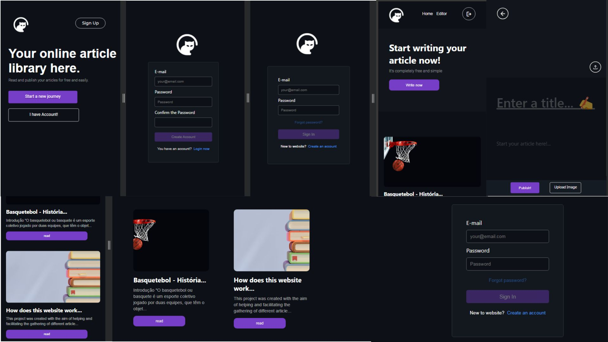

# Library Online

</img>


# About this project
The website ideia is: "How about bringing together multiple articles, blogs, news, troubleshooting and more on one site?"

**Note:** The website code is unlimited! I chose articles as the main topic. But if you wish, you can change it to your theme.

The site was not hosted on any hosting. But for testing I started the server on my localhost and started ngrok to have a public link.

#### Important observations:
**1** - I did not program the password recovery option, although it appears in the login option. 😉

**2** - The image upload is not connected to firebase storage, so the images are being uploaded on your machine in the uploads/ folder. 🗂️

---

# Website operation 👇
**Obs:** I don't know how to make good diagrams, I TRIED!
If you use a light theme color, the dark diagram is on the readme page.

</img>


# Future implementations
- Comment system
- Search by filter

---
# Getting started
**Prerequisites**
To use this project I used npm and firebase.
You must enter your API KEY and information in **firebase-init.js**

**Clonning the repository**
```
$ git clone https://github.com/luismede/Library-articles-or-blogs/

$ cd Library-articles-or-blogs
```
**Installing dependencies**
```
$ npm install
```
#### Don't forget, change your firebase-init.js
```js

const firebaseConfig = {
    
    // YOUR FIREBASE HERE
     apiKey: "",
     authDomain: "",
     projectId: "",
     storageBucket: "",
     messagingSenderId: "",
     appId: ""
};

```


**Booting the server**
```
$ npm start
```

---

## Contributing with me
If you are interested in the project and think you can contribute in some way to correcting or improving something. this is my contact:

E-mail: luishenrique23h@hotmail.com

**And of course, feel free to submit your PRs**

Thanks

### License
MIT License - 2024
